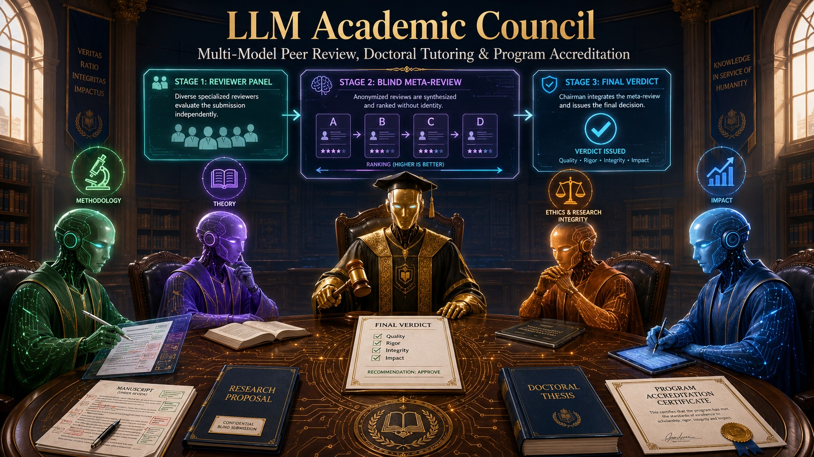

# LLM Academic Council · Consejo Académico LLM

> 🇪🇸 Español primero · 🇬🇧 [English below](#english)

Un comité académico multi-modelo construido sobre [llm-council de Andrej Karpathy](https://github.com/karpathy/llm-council). En lugar de pedirle una opinión a un solo LLM, un panel de modelos con **roles de revisor complementarios** evalúa tu insumo, se somete a una **meta-revisión anonimizada**, y un **Presidente del Comité** emite un dictamen estructurado.



## Casos de uso

| Modo | Caso de uso | Dictamen final |
|---|---|---|
| `proyecto` | Evaluación de proyectos de investigación (panel de agencia financiadora) | Puntuación por criterio (1-5) + recomendación: Financiable / Financiable con ajustes / No financiable |
| `manuscrito` | Revisión por pares de papers y abstracts | Carta de decisión editorial: Aceptar / Cambios menores / Cambios mayores / Rechazar |
| `doctorado` | Tutoría doctoral (comité tutorial) | Informe formativo con plan de acción y semáforo de avance |
| `acreditacion` | Acreditación de programas académicos | Informe de evaluación externa con tabla de cumplimiento y plan de mejora |

## Cómo funciona

Conserva la arquitectura de 3 etapas de Karpathy, resignificada para evaluación académica:

1. **Etapa 1 — Panel de revisores.** Cada modelo del consejo asume un rol distinto: Revisor Metodológico, Revisor Teórico-Conceptual, Revisor de Ética/Integridad/Métricas Responsables (DORA, Manifiesto de Leiden, CoARA) y Revisor de Impacto y Comunicación. Cada uno evalúa con la rúbrica del modo activo.
2. **Etapa 2 — Meta-revisión anonimizada.** Cada modelo evalúa la calidad de los informes de los demás (rigor, especificidad, cobertura de la rúbrica, justicia del tono) sin saber quién escribió qué, como en una revisión ciega real.
3. **Etapa 3 — Dictamen del Presidente.** El modelo Chairman pondera los informes según la meta-revisión y emite el dictamen estructurado del modo correspondiente.

## Selección del modo

Tres mecanismos, en orden de prioridad:

1. **Etiqueta explícita** al inicio del mensaje (recomendado): `[modo: manuscrito] ...`
2. **Detección por palabras clave** ("convocatoria" → proyecto, "tesis" → doctorado, etc.)
3. **Clasificación automática** con un modelo rápido si lo anterior es ambiguo.

### Ejemplo

```
[modo: manuscrito]
Evalúa el siguiente manuscrito para una revista Q2 de cienciometría:
<título, abstract y secciones clave>
```

## Instalación

Requiere [uv](https://docs.astral.sh/uv/) y Node.js.

```bash
# Backend
uv sync

# Frontend
cd frontend && npm install && cd ..

# API key (crea .env en la raíz)
echo "OPENROUTER_API_KEY=sk-or-v1-..." > .env

# Arrancar
./start.sh
```

Abre <http://localhost:5173>. La clave se obtiene en [openrouter.ai](https://openrouter.ai/).

## Personalización

- **Modelos:** `COUNCIL_MODELS` y `CHAIRMAN_MODEL` en `backend/config.py`.
- **Roles de revisor:** `REVIEWER_ROLES` (puedes añadir, p. ej., un revisor estadístico). Se asignan cíclicamente a los modelos.
- **Rúbricas y dictámenes:** cada modo en `ACADEMIC_MODES` tiene `rubrica` y `dictamen` editables. Para alinearlos a una agencia específica (CNA, SUNEDU, ANECA, CONCYTEC), sustituye las dimensiones genéricas por los criterios oficiales.

## Uso responsable

- El dictamen es **apoyo a la decisión humana, no la sustituye** (alineado con DORA y CoARA).
- No subas manuscritos confidenciales de terceros sin autorización: el contenido viaja a OpenRouter y a los proveedores de cada modelo.
- Los modelos pueden sugerir referencias inexistentes; verifica siempre toda cita antes de usarla.
- Para textos largos, envía por capítulos o secciones: el costo crece rápido con 4 modelos × 2 rondas.

## Créditos

Fork de [karpathy/llm-council](https://github.com/karpathy/llm-council) (MIT-spirit "vibe code", provisto como inspiración). La adaptación académica añade roles de revisor, rúbricas por modo, detección de modalidad y dictámenes estructurados.

---

<a name="english"></a>

# 🇬🇧 English

A multi-model academic committee built on top of [Andrej Karpathy's llm-council](https://github.com/karpathy/llm-council). Instead of asking a single LLM for an opinion, a panel of models with **complementary reviewer roles** evaluates your input, undergoes **anonymized meta-review**, and a **Committee Chair** issues a structured verdict.

## Use cases

| Mode | Use case | Final verdict |
|---|---|---|
| `proyecto` | Research project evaluation (funding-agency panel) | Per-criterion scores (1-5) + funding recommendation |
| `manuscrito` | Manuscript peer review | Editorial decision letter: Accept / Minor / Major / Reject |
| `doctorado` | Doctoral supervision (tutorial committee) | Formative report with action plan and progress traffic light |
| `acreditacion` | Academic program accreditation | External evaluation report with compliance table and improvement plan |

## How it works

Karpathy's 3-stage architecture, repurposed for academic evaluation:

1. **Stage 1 — Reviewer panel.** Each council model takes a distinct role: Methodological Reviewer, Theoretical-Conceptual Reviewer, Ethics/Integrity/Responsible Metrics Reviewer (DORA, Leiden Manifesto, CoARA), and Impact & Communication Reviewer, each applying the active mode's rubric.
2. **Stage 2 — Anonymized meta-review.** Each model evaluates the quality of the other reviews (rigor, specificity, rubric coverage, fairness) without knowing authorship — like real blind review.
3. **Stage 3 — Chair's verdict.** The Chairman model weighs the reviews according to the meta-review and issues the structured verdict for the active mode.

## Mode selection

Priority order: explicit tag at the start of your message (`[modo: manuscrito] ...`), keyword detection, then automatic LLM classification.

## Setup

Same as the original: `uv sync`, `npm install` in `frontend/`, an `OPENROUTER_API_KEY` in `.env`, then `./start.sh` and open <http://localhost:5173>.

## Customization

Edit `backend/config.py`: `COUNCIL_MODELS` / `CHAIRMAN_MODEL` for models, `REVIEWER_ROLES` for reviewer personas, and `ACADEMIC_MODES` for per-mode rubrics and verdict templates (swap the generic dimensions for your agency's official criteria — CNA, SUNEDU, ANECA, etc.).

## Responsible use

The verdict **supports human decision-making, it does not replace it** (in line with DORA and CoARA). Do not upload confidential third-party manuscripts without permission — content is sent to OpenRouter and model providers. Always verify any suggested reference before using it.

## Credits

Forked from [karpathy/llm-council](https://github.com/karpathy/llm-council). The academic adaptation adds reviewer roles, per-mode rubrics, mode detection, and structured verdicts.
